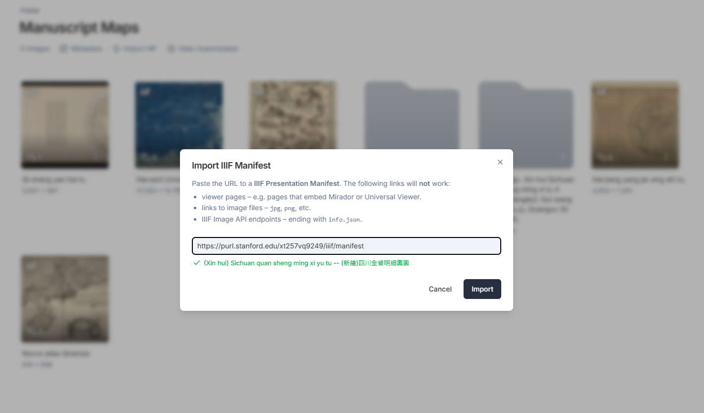
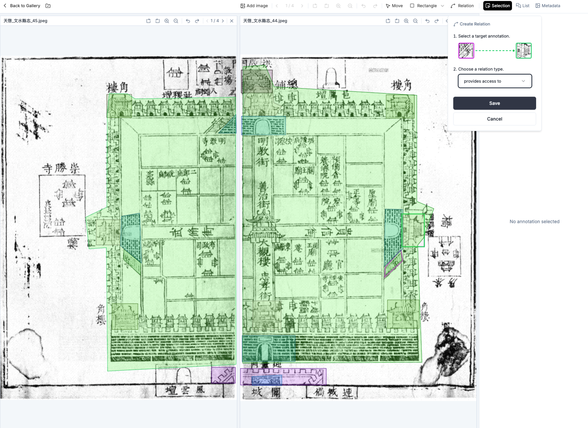
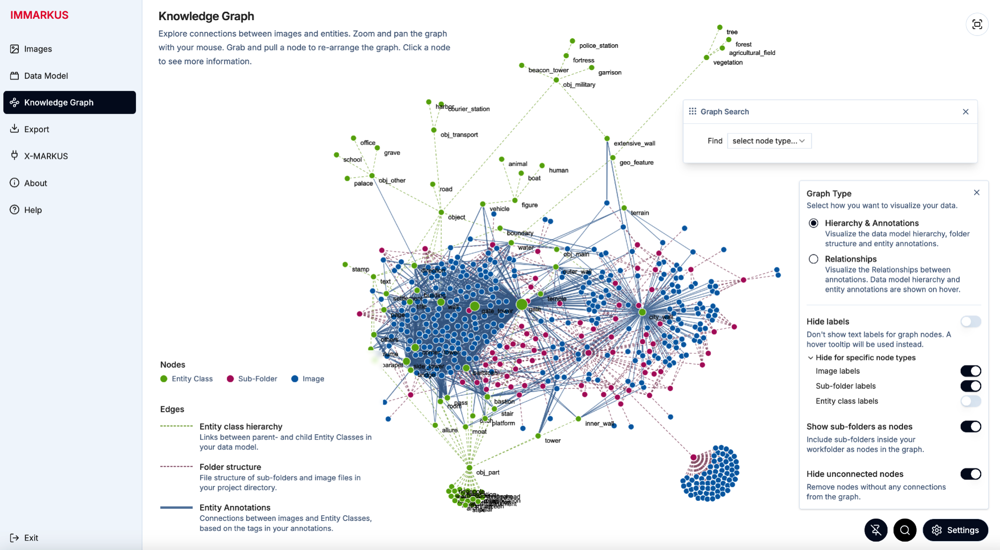

Here are some of the highlights of what IMMARKUS offers.

## Work with IIIF Manifest Imports

IMMARKUS supports importing IIIF manifests, enabling users to access, manage, and annotate image collections from diverse sources. By leveraging IIIF’s high-resolution image streaming, users can work with detailed zoomable images without the need for large local storage.

**Figure 1.** Importing a IIIF Manifest in IMMARKUS

* Read more about [Working with IIIF Sources](02-Importing-Images#working-with-iiif-sources)

## Multi-Window Zoomable Image Annotation

IMMARKUS provides a zoomable view to support annotating large images, and tools for creating __rectangle__, __polygon__ and __circle/ellipse__ selections. Similar to multi-image viewers like [Mirador](https://projectmirador.org/), IMMARKUS provides a multi-window environment for annotating multiple images side by side.

**Figure 2.** Multi-Window Zoomable Image Annotation in IMMARKUS

* Read more about [Annotating Multiple Images Simultaneously](https://github.com/rsimon/immarkus/wiki/05-Annotating-Images#annotating-multiple-images-simultaneously)

## AI-Powered Smart Selection Tool (Coming Soon)

IMMARKUS allows you to work with AI-powered smart object selection for automatic shape detection which you can manually refine and modify. Upcoming features will include irregular shape drawing, along with merge and subtract options!

**Figure 3.** Selecting a Human Figure with the Smart Selection Tool in IMMARKUS

* Read more about [Smart Selection Tools](05-Annotating-Images#🛠️-smart-selection-tools)

## Relation Annotation 

With IMMARKUS you can add relationships between annotated entities. You have the option to create directed or undirected relations and set constraints on the source and target entities.

**Figure 4.** Creating a Relation between Two Entities in IMMARKUS

* Read more about [Adding Relationships between Entities](05-Annotating-Images#adding-relationships-between-entities)

## Design Your Own Data Model

IMMARKUS includes a form-based editor for creating and managing your personal data model. The data model is designed around the concepts of **Entity Classes** and **Properties**.

- Use __Entity Classes__ to annotate classes of concepts or things (e.g., a city wall, a bridge, a human figure, an animal, a plant).
- Define __Properties__ for your Entity Classes, to record specific details about entity classes (e.g., name, dimension, location, identifier). 
- Your data model can be __hierarchical__. Each entity class can have a parent class. Properties of the parent class are automatically inherited by the child class. This allows you to define common properties that are shared between parent and child entity classes, as well as properties that are particular to child classes.

**Figure 4.** Defining Entities in IMMARKUS

* Read more about [Designing a Data Model](https://github.com/rsimon/immarkus/wiki/04-Designing-a-Data-Model)

## Property Types

IMMARKUS offers a range of data types you can use to capture properties of different entity classes. Think of it as a personal "database builder" for your data model. The following seven data types are currently available:

- Text 
- Number
- Options
- URI
- Geo-coordinates
- Measurement 
- External Authority 

**Figure 5.** Defining Properties in IMMARKUS

* Read more about [Property Options](https://github.com/rsimon/immarkus/wiki/04-Designing-a-Data-Model#property-options)

## Knowledge Graph Visualization
IMMARKUS features a **Knowledge Graph** Mode for visualizing and exploring relationships between corpus folders, images, entities, and annotations.

**Figure 6.** Navigating Annotations in Knowledge Graph Mode in IMMARKUS

* Read more about [Exploring Data in Knowledge Graph](07-Exploring-Data-in-Knowledge-Graph.md)
