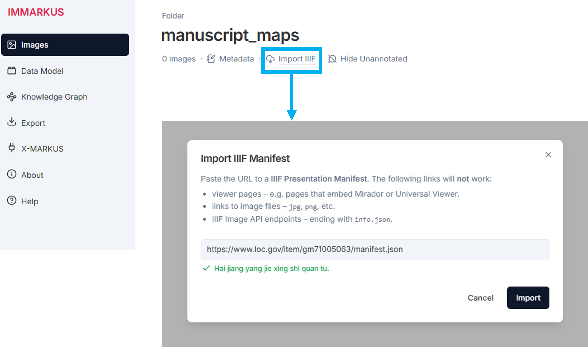

IMMARKUS uses a novel browser feature which is currently unavailable on Firefox, Safari and mobile devices. Please use **Chrome** or **Edge** on the desktop to access IMMARKUS.

1. To start working with IMMARKUS, create or locate a folder with JPEG or PNG files on your computer. If you are working exclusively with IIIF sources, select an empty folder.

**NOTE:** IMMARKUS stores data directly on your computer. We recommend that you work with copies of your work folder, and make regular backups of your files in another folder to avoid the loss of data.

2. Go to IMMARKUS [immarkus.xmarkus.org](https://immarkus.xmarkus.org/)

3. Click **Open New Folder** and select the folder that contains your images or the empty folder designated for annotating IIIF sources.  
 

**Figure 1.** The IMMARKUS Main Page [immarkus.xmarkus.org](https://immarkus.xmarkus.org/)

 If you have already used IMMARKUS, the folder with which you last worked will be displayed next to **Open New Folder** (in **Figure 1** above, the folder "Ming illustrative map") 

4. You will see a popup window asking "Let site edit files?" Click **Edit files** to allow IMMARKUS to edit the files in the selected folder. 

## Working with IIIF Sources
IMMARKUS supports IIIF import, enabling you to work with collections compliant with the IIIF standard. This helps reduce the need for local storage. You can always export annotations and relationships, along with image snippets, to your computer. 

**Import IIIF Manifest**
Paste the URL to a **IIIF Presentation Manifest into the dialogue box**

**Figure 2.** Pasting IIIF Manifest Link to Import

## Image Size
Limit your image size to 10 MB to ensure IMMARKUS can open them. If you are working with images above 10 MB, we recommend converting them to lower quality images for your work in IMMARKUS. 

## Subfolder organization 
In IMMARKUS it is possible to upload one folder with several subfolders and apply the same data and metadata model to subfolders. We recommend organizing images into subfolders according to shared features (e.g. they belong to the same publication or collection). If you have images from different sources (**Figure 3**) consider storing those from the same source together. You can then fill in the shared bibliographic information for all images in the same subfolder in the [subfolder metadata](https://github.com/rsimon/immarkus/wiki/06-Working-with-Metadata). The subfolder structure will be visible in the .XLSX export of annotations.

**Figure 3.** Creating Multiple Folders by Topic (Left) and Subfolders for Each Source (Center)

Folders can have several levels of subfolders, as shown in **Figure 3**, the top folder is named after the theme of the main project (i.e. cartographic ethnography) and contains the data model .JSON file (_immarkus.model.json) that applies to all image files in this folder. The subfolders at the next level are named after sub-themes (i.e. maritime frontier, northern frontier, and southwestern frontier). You can store different metadata information at each level of the subfolder structure if needed. At the next level subfolders are divided by the source title (i.e. sanzhen tushuo_painted_atlas_juan 2) and contain images intended for annotation. At this level you could, for example, store the bibliographic information for the source, which could be applied to all the images in this subfolder (**Figure 4**).

**Figure 4.** Subfolder Organization in IMMARKUS
   

**Figure 4.** Subfolder Metadata

## Image and Folder Size

To ensure optimal performance, keep your projects manageable. Limit the number of subfolders and limit the number of images in your subfolders to 100, with a recommended maximum size of 10 MB per image (see [Image Size](https://github.com/rsimon/immarkus/wiki/02-Uploading-Images#image-size) above). Keep in mind that metadata models can be exported and reused in projects (see [Importing Metadata Models](https://github.com/rsimon/immarkus/wiki/06-Working-with-Metadata#importing-data-models-for-metadata)).

