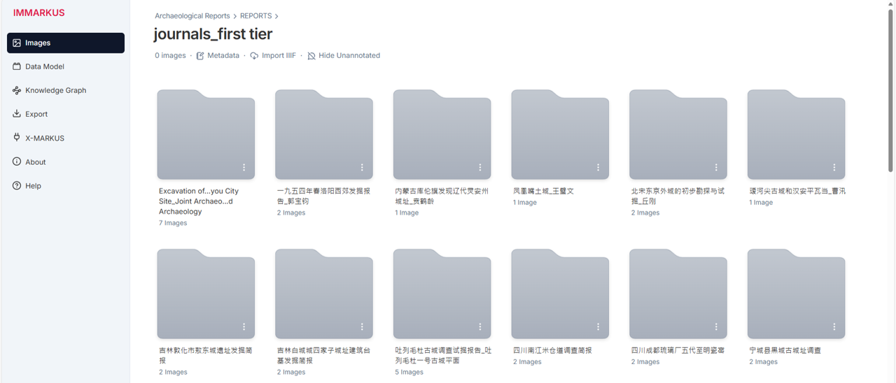

After [uploading an image folder](https://github.com/rsimon/immarkus/wiki/02-Uploading-Images), the IMMARKUS interface appears. The following options are available from the left menu bar:

1.	**Images** is where all the subfolders are stored. Clicking on an image opens the [annotation mode](https://github.com/rsimon/immarkus/wiki/05-Annotating-Images).
2.	**Data Model** is where you can create or edit a [data model](https://github.com/rsimon/immarkus/wiki/04-Designing-a-Data-Model) for annotating images. You can also define a schema for [metadata](https://github.com/rsimon/immarkus/wiki/06-Working-with-Metadata).
3.	**Knowledge Graph** allows you to [view and search](https://github.com/rsimon/immarkus/wiki/07-Exploring-Data-in-Knowledge-Graph) your source images and annotations, to explore connections between them, to navigate to the desired content, and to export search results. 
4.	**Export** is where you can [export all your data](https://github.com/rsimon/immarkus/wiki/07-Exporting-Data) in different formats. 
5.	**X-MARKUS** currently provides links to other modules in the X-MARKUS platform.
6. **About** is where you can find information on funding for the project and how to cite us.
7. **Help** leads you back to this wiki page.

**Figure 1.** The IMMARKUS Interface Showing the Image Gallery

In the Image Gallery of your subfolder, you can click **Hide Unannotated** to display only the annotated images. Click the button again to **Show Unannotated** images.

**Figure 2.** Hiding an Image without Annotation in the Upper Part by Clicking **Hide Unannotated**; It Can Be Shown Again by Clicking **Show Unannotated** as Outlined in the Lower Part
