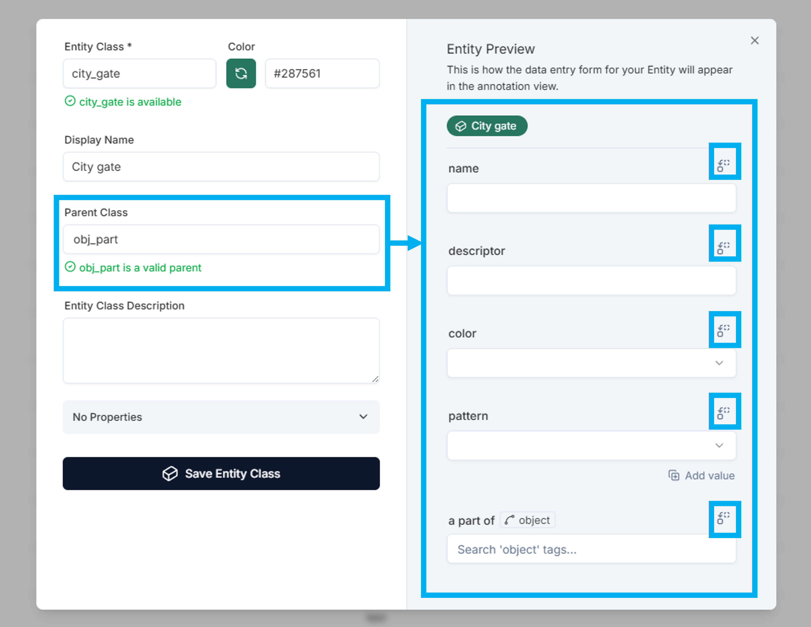
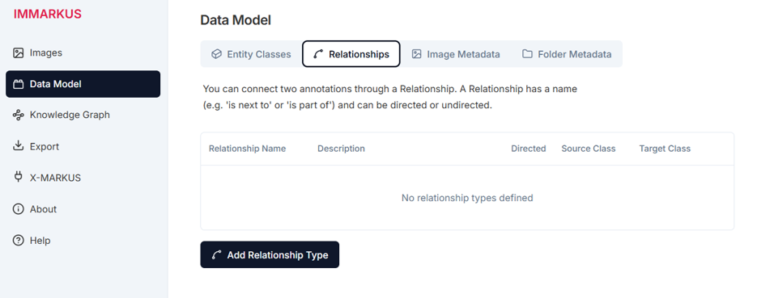

In IMMARKUS you can define a data model consisting of entity classes and properties. A well-designed data model can help ensure that you collect data in a systematic way that is tailored to the research questions the annotation process is intended to address. Data models can also help ensure consistency in collaborative research projects.

**Entity classes** are used to annotate classes of concepts or things (e.g., a city wall, a bridge, a human figure, an animal, a plant); **properties** can be used to record specific details about entity classes (e.g., name, dimension, location, identifier). You can create and view entities and properties in both [Annotation Mode](https://github.com/rsimon/immarkus/wiki/05-Annotating-Images) and **Data Model** Mode. 

In an IMMARKUS hierarchical data model, you can define common properties that are shared between parent and child entity classes. Child classes inherit properties from parent classes. We can also define properties that are particular to child classes.

**Attention!** You cannot have two data models for the same project (or a subfolder). To have a different data model, you must create a separate project. 

# Creating Entities and Properties in the Data Model Mode

To create entities and properties in the data model mode, enter the data model mode by clicking **Data Model** on your left side bar.

1. On the upper menu bar you will see that you are editing entity classes. Click **Create New Entity Class**.

        
    **Figure 1**. Creating Entities in the Data Model Mode

2. Click **Entity Class** and name the entity class (e.g. "bridge”).

    •	You can select the color of each entity on the right panel.

3. 	You can define a different **Display Name**. Or you can leave it empty to display the same entity class name (e.g. "bridge")
4.	Add an **Entity Class Description** that explains the use of this entity class (e.g., "a bridge is an elevated structure across a river or other obstacles")

5.	Add/edit the properties. Click the drop down menu next to **No Properties** (circled in blue in **Figure 2**)

    

    **Figure 2.** Creating Properties in the Data Model Mode

6.	Click **Add Property**. This opens the property editor as shown in **Figure 3**.

    []

    **Figure 3.** Adding Properties in the Data Model Mode

7.	Define the **Property Name**.

8.	Select a data type by clicking the drop-down menu under **Data Type**. You can select as many properties as you need to create a schema for your entity class. The following seven data types are currently available:

    ### Property Options

    * **Text** - a basic text field

    * **Number** - a numeric field

    * **Options** - a list of values to choose from

    * **URI** - a text field which validates whether the content is a URI, and which will be clickable in the interface

    * **Geo-Coordinates** - a latitude/longitude coordinate pair

    * **Measurement** – a number combined with a measurement word

    * **[External Authority](https://github.com/rsimon/immarkus/wiki/05-Annotating-Images#using-external-authorities-in-annotations)** - external authority services such as TGAZ, CBDB, and Wikipedia.

9.	In this case the data type of "id" is **Text**. You can also add a description of the property in **Property Description**.

    

    **Figure 4.** Selecting a Data Type in the Data Model Mode

10.	After you have added each property, click **Save Property**. 

11.	When you have finished adding properties, click **Save Entity Class**.

	 

# Creating Parent-Child Entity Classes in the Data Model Mode

In **Data Model**, you can define common properties that are shared between parent and child entity classes. Child classes inherit properties from parent classes. You can also define properties that are particular to child classes. (If you cannot locate the data model mode, see the [The Interface](https://github.com/rsimon/immarkus/wiki/03-The-Interface)) 

You can create a child class in both annotation mode and data model mode. 

1. Click the **Create New Entity** button 

1. Define **Entity Class** (city_gate) 

1. Define **Display Name** (City gate) 

1. Select the **Parent Class** (in this case the Parent is obj_part) 

**Figure 5.** Creating Parent-Child Relationships

## Inherited Properties

In **Figure 5 and 6**, the child class named "city_gate" inherits all the properties from the parent class named "obj_part".  

In the Properties editor, it looks like this entity does not have any properties. This means no particular property has been added to this child class. The child class city_gate inherited all the properties from its parent class (outlined in blue) as shown on the right panel in **Figure 6**.

**Figure 6.**  The Child Class "city gate" Inherits Properties from its Parent Class "obj_part" 

## Viewing Parent-Child Relationships

Classes do not need to have a parent-child relationship. Whether they do depends on your own data design. 

The entity classes for which you have created child classes have a drop-down menu (“>”) on the left (red square in **Figure 7**). 

* Click the drop-down menu to expand the parent class and you will see child classes belonging to the parent class.  

* The properties belonging to or inherited from the parent to the child class are shown in the row for the parent class.  

* In the row of the child class, you can only see the properties that have been specifically added to the child class (see the properties for "location_site" parent and "survey area" child in **Figure 7**). 

Classes that do not have children do not have a drop-down menu (blue square in **Figure 7**).  

**Figure 7.** Entity Classes in the Data Model

# Creating Relationships between Entities in the Data Model Mode

In **Data Model**, you can define connections between two entity classes through a **Relationship**.

1. Click **Relationships** on the upper menu bar. 

2. Click **Add Relationship Type** to define a new relationship.

    
    **Figure 8.** Creating Relationships in the Data Model Mode

3. You can enter a name for the relationship and specify whether it is directional, where the source and target roles are distinct.

    
    **Figure 9.** Defining the Relationship Name, Direction, and Description

4. You can restrict the relationship to specific source and target entity classes.

    
    **Figure 10.** Restricting Entity Classes for the Source and Target in the Example Relationship "spans"

# Importing an Entity Class Model

If you want to reuse data models that you developed in other projects, you can import data models for **Entity Classes**, **[Image Metadata, and Folder Metadata](https://github.com/rsimon/immarkus/wiki/06-Working-with-Metadata#importing-data-models-for-metadata)**. You can also make use of preset  data models.

To import an entity class data model, click **Import Model** (blue square in **Figure 11**).  

  
**Figure 11.** Importing an Entity Class Data Model 

From the pop-up window you can import a model or replace the current model. Keep in mind that replacing an existing schema will remove all its entity classes (**Figure 9**).

  
**Figure 12.** Replacing the Current Data Model 

You can decide how you want to handle duplicate classes (**Figure 10**). You can either keep the existing classes that you had in your model before importing the data model (**Keep Existing** button), or you can have the existing classes  replaced by the ones in the imported model (**Keep Imported** button).  

  
**Figure 13.** Handling Duplicate Entity Classes 

The imported model can still be modified using [entity classes and properties](https://github.com/rsimon/immarkus/wiki/04-Designing-a-Data-Model#creating-entities-and-properties-in-the-data-model-mode) described above.

