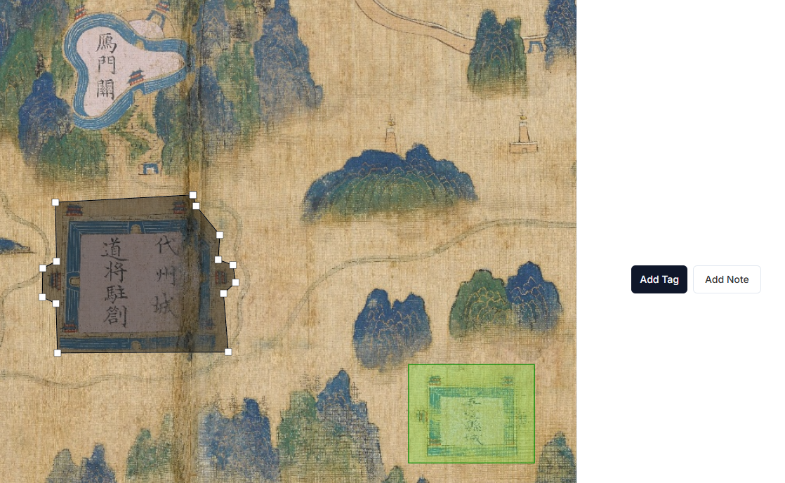
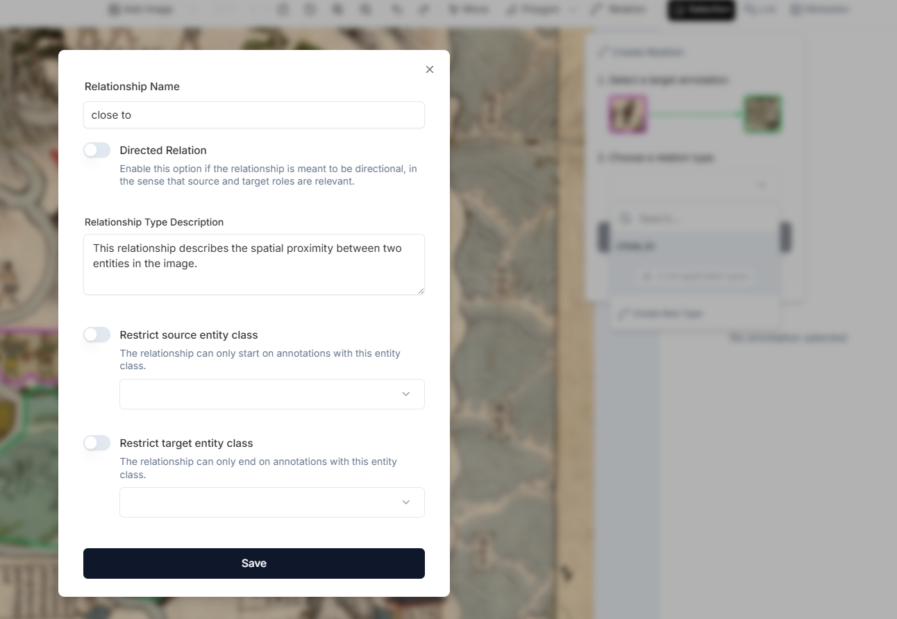

To add annotations to your images, click the subfolder containing the images you want to work with in the image gallery. This will open the images in the folder, and you can start annotating. 

# Overview

The following functionalities are available in the annotation mode (numbers correspond to those in **Figure 1**) 
1.	[Add an image](https://github.com/rsimon/immarkus/wiki/02-Uploading-Images)
2.	Browse the images in the same subfolder / click arrows to display the previous or next image 
3.	Rotate image 90° to the left or to the right 
4.	Zoom in or zoom out of an image
5.	Undo/redo 
6.	Move (pan) across the image
7.	[Draw a shape](https://github.com/rsimon/immarkus/wiki/05-Annotating-Images#drawing-annotations) (select rectangle, polygon, or ellipse)
8.  Add relation between two entities
9.	See details of the currently selected annotation 
10. List your annotations
11. Add or edit [individual image metadata](https://github.com/rsimon/immarkus/wiki/06-Working-with-Metadata)

**Figure 1.** Annotation Mode

# Drawing Annotations

Decide which part of the image you would like to tag and draw a shape.

1. Click the draw button (#7 in **Figure 1**) and select one of the three options for drawing shapes (rectangle, polygon, or ellipse).
2. Click once - without keeping the mouse button pressed - to start drawing.
    * When drawing a rectangle or ellipse, move the mouse and click again once to complete the shape.
    * When drawing a polygon, each further click adds another point. If you double click, or click once on the first point of the polygon, you will close the shape and complete the drawing.
    * If you need to move the image while you are drawing, click and keep the mouse button pressed to drag the image.
3. When you have finished drawing, you will be asked to add a tag. Click **Add Tag** to [add entities and properties](https://github.com/rsimon/immarkus/wiki/05-Annotating-Images#adding-entities-and-properties-to-image-selections).

## 🛠️ Smart Selection Tools

Additionally, we are developing advanced **Smart Selection Tools**, which will be available soon. These include:

* AI-Powered Selection Tool – Automatically selects objects with the option for manual refinement.
* Donut Shape Selection – Allows deduction of part of the selection for donut-shaped objects.
* Magnetic Outline – Enables precise drawing around the desired part of the image.

# Adding Entities and Properties to Image Selections

You can add or create entities and properties by following the steps below:

1. Decide which part of the image you would like to tag and [draw a shape](https://github.com/rsimon/immarkus/wiki/05-Annotating-Images#drawing-annotations). Once you have drawn a shape, you will see the **Add Tag** and **Add Note** buttons in the panel on the right. Select **Add Tag** and a popup window appears.

2. If you have already created a data model, the existing entities will appear along with any other entities you created before as shown in **Figure 2**. You can reuse these entities and their properties to annotate the image selection. You can also search through your entities to locate the one needed if you have created many.

    
    
    **Figure 2.** Adding or Creating Entities in Annotation Mode

3.	If you have not yet defined a data model or if you would like to add a new parent or child entity class to annotate the image selection, click **Create New Entity Class** and name the entity class (e.g. "gate_tower”). You can select the color of each entity on the right panel. Follow the steps below to complete the creation of a new entity class. This new class will be automatically added to the data model.

* The workflow for creating entitities and properties is identical to the one in [Data Model Mode](https://github.com/rsimon/immarkus/wiki/04-Designing-a-Data-Model). 

4.	You can define a different **Display Name**. (e.g. "gate tower").
5.	You can choose to add your new entity class as a child class of one of your existing entities. In the **Parent Class** field, type the name of the entity class that you want to make the parent of your new entity class (e.g. "obj_part").
6.  Once you have defined your new entity class as a child class, the properties of its parent class will be displayed in the entity preview. (see the right side of the panel in **Figure 3**). You can read more about inherited properties [here](https://github.com/rsimon/immarkus/wiki/04-Designing-a-Data-Model#inherited-properties).

7. Add an **Entity Class Description** that explains the use of this entity class. This field is optional.  

8. Add/edit the properties. Click the drop down menu next to **No Properties** (circled in blue in **Figure 3**)

    

    **Figure 3.** Creating Entities and Properties

9.	Click **Add Property**. This opens the property editor as shown in **Figure 4**.

    
    **Figure 4.** Adding Properties

10.	Define the **Property Name**.

11.	Select a data type by clicking the drop-down menu under **Data Type**. Click here for [Property Options](https://github.com/rsimon/immarkus/wiki/04-Designing-a-Data-Model#property-options).

12.	In this case, the data type of "number of floors" is **Number**. You can also add a description of the property in **Property Description**.

    

    **Figure 5.** Selecting a Data Type

13.	After you have added each property, click **Save Property**. 

14.	When you are done adding properties, click **Save Entity Class**.

## Using External Authorities in Annotations

Using the External Authority property type allows you to associate an entity class with one or more external authority services. You can add multiple authorities per field, and multiple fields per entity class. 

1. In the property editor, type a name for your property ("place ID" in **Figure 6**) and select the External Authority field type.

    
    **Figure 6.** Available Options for External Authorities

2. As you fill in properties for the annotated entity, the external authority popup displays a search field and the authority service result page below it.  

3. Click the ↗ icon on the right side of the search field to open the current authority search in a new browser tab. 

4. To add an id paste the relevant information from the external authority in the corresponding field of the schema.

    

    **Figure 7.** TGAZ Result of "Guangchang County" 

# Adding a Note

You can add a note to a selected part of your image. This is useful if you want to make a note about the image for future use, but do not want to include that information in the annotations.

Select a part of your image and [draw a shape](https://github.com/rsimon/immarkus/wiki/05-Annotating-Images#drawing-annotations). 
You will see the **Add Tag** and **Add Note** buttons in the panel on the right. 

**Figure 8.** Adding a Note to a Selected Image Part

Click **Add Note**. Be sure to click **Save** after writing your note.

You can also add a note to any image selection that you have already annotated. Select the annotation, and then scroll down to the bottom and click the **Add Note** button (in bue on **Figure 9**). This is useful if you want to add a note unrelated to existing properties or want to add extra information for future reference.

**Figure 9.** Adding a Note to a Selection of an Image with an Existing Tag

# Adding Relations between Entities

You can define connections between two annotations through a **Relationship** in the annotation mode.

1. Select the source entity you want to establish a relation from.

2. Click **Relation** in the upper menu bar.

    

    **Figure 10.** Selecting the source annotation in a relation

3. Select the target entity.
    

    **Figure 11.** Selecting the target annotation in a relation

4. Choose from existing relationships, or click **Create New Type** to define a new relationship.
    

    **Figure 12.** Defining the relationship type between the selected annotations

5. To create a new relationship type, enter the relationship name, specify if it is directed, and set restrictions for source and target entity classes.

    
    **Figure 13.** Creating a new relationship type in **Annotation Mode**

You can view all defined relationships in the **List** panel. You can filter the list view with conditions on **Entity Classes** or **Relationship Types**.

**Figure 14.** Navigating all annotations in the **List** panel

You can click the source or target thumbnail in **List** panel to locate the anntation in the image. 

**Figure 15.** Locating the annotation area in the image for the sourse entity in the selected relationship "close_to"

You can click the pencil icon to modify the relation type or delete it.

**Figure 16.** Modifying relation in **Annotation Mode**

	 
# Annotating Multiple Images Simultaneously

You can annotate multiple images side by side. 

1. Click **Add Image** (red square in **Figure 10**) and select the image(s) that you want to annotate together.

2. You can drag and drop windows to move them around and change their layout.

**Figure 17.** Annotating Multiple Images Simultaneously Using Add Image (Red Square)

