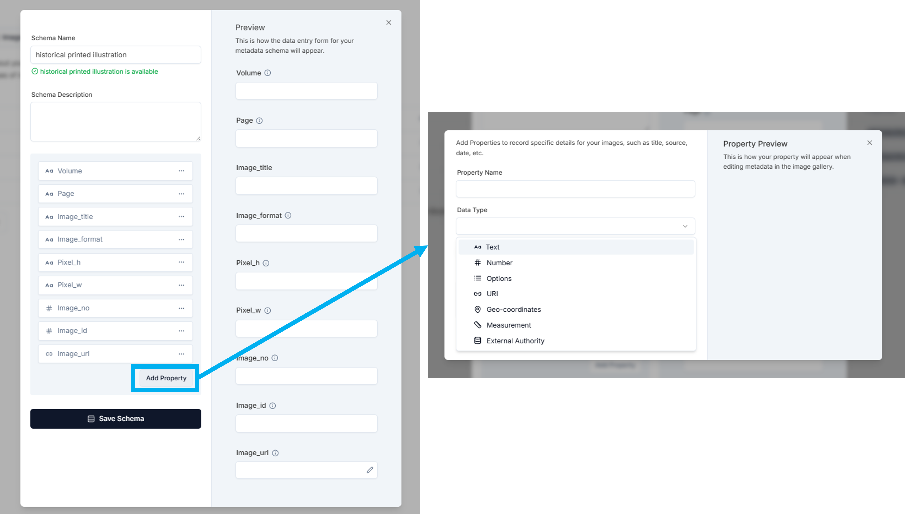
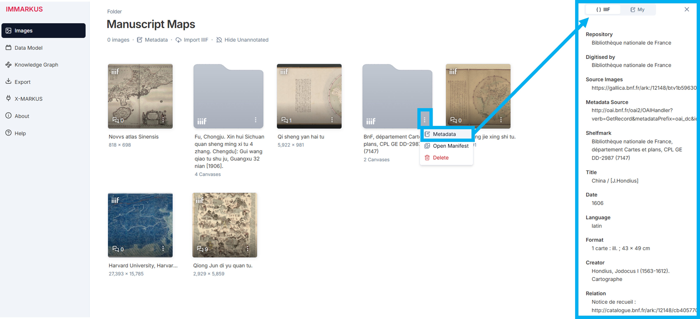
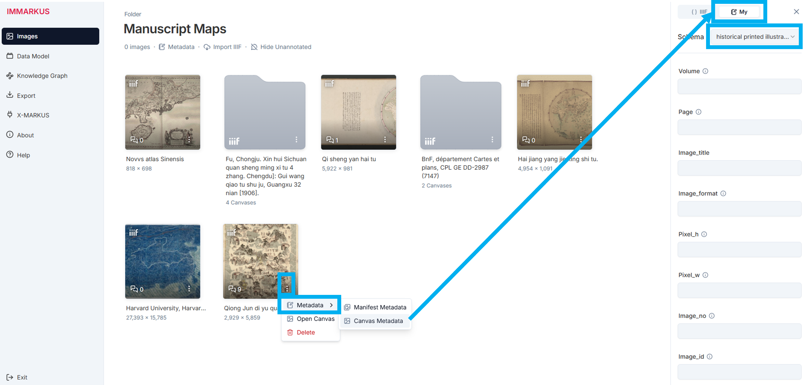

# Creating a Metadata Schema

You can create a metadata schema in the **Data Model** view. You can record metadata at the folder (or subfolder) level as well as at the individual image level. 
- The [Image Metadata Schema ](https://github.com/rsimon/immarkus/wiki/06-Working-with-Metadata#adding-a-metadata-schema-for-individual-images) defines how you describe individual __image files__ in your collection.
- The [Folder Metadata Schema](https://github.com/rsimon/immarkus/wiki/06-Working-with-Metadata#adding-a-folder-metadata-schema) defines how you record information about the __directory folders__ in your collection. This can be useful if your folder contains images from the same book, artwork, or publication, so that you do not have to enter in the same metadata information for each individual image in the subfolder.

## Adding a Folder Metadata Schema

1. In the **Data Model** view, go to the **Folder Metadata** tab and click **New Folder Schema**. 

    

    **Figure 1**. Examples of Folder Metadata Schemas

2.  Metadata categories are added in the same way as properties for entity classes with similar [property options](https://github.com/rsimon/immarkus/wiki/04-Designing-a-Data-Model#property-options).  

    

    **Figure 2.** Adding a Schema for Folder Metadata

3. Add a metadata field under **Property Name** ("author_cbdb_id”) and select a **Data Type** ("External Authority"-select at least one external authority, such as CBDB). Click **Save Property**. 

    

    **Figure 3.** Setting a Data Type in a Folder Metadata Schema

4. Be sure to click **Save Schema** after you are done adding properties.

   

    **Figure 4.** Saving a Folder Metadata Schema

## Adding a Metadata Schema for Individual Images

A metadata schema for individual images can be added in the same way as metadata schemas for folders.  

1. Go to **Image Metadata** and click **New Image Schema**. 

   

    **Figure 5.**  Creating a Metadata Schema for Individual Images

2. Define **Property Name** and select **Data Type**. Click **Save Property**. 

     
    **Figure 6.** Setting a Data Type in a Metadata Schema for Individual Images

# Importing Data Models for Metadata

## Importing an Image Metadata Model 
To import an image metadata model click **Import Model** under **Image Metadata** (**Figure 7**).

**Figure 7**. Importing a Model for Image Metadata

From the pop-up window you can upload an image metadata model (**Figure 8**) or replace the current schema. You can also indicate how duplicates should be handled (**Figure 9**).

  
**Figure 8.** Importing a Metadata Model  

  
**Figure 9.** Handling Duplicate Classes during Import

When importing an image metadata model, you can choose to import from preset image metadata models (in blue on **Figure 10**) which include schemas for ‘archaeological image’, ‘artwork’, and ‘historical printed illustration’ or you can click **Upload Datamodel File** to upload your own data model.

  
**Figure 10.** Importing Predefined Image  Metadata Models

## Importing a Folder Metadata Model

To import a folder metadata model, click the **Import Model** button under **Folder Metadata** (in blue on **Figure 11**).

**Figure 11.** Importing a Model for Folder Metadata

The pop-up is identical to the one in **Image Metadata** (**Figures 8** and **9**) and you can select from the same options. The preset options include ‘artwork’, ‘historical printed text’, ‘journal article’, and ‘modern monograph’  (**Figure 12**).

  
**Figure 12.** Importing a Preset Folder Metadata Model

# Recording Metadata

After defining your metadata schemas, you can enter metadata for folders and images in the image gallery and knowledge graph. You can also enter image metadata in the annotation mode (but not folder metadata).

## Recording Folder Metadata in the Image Gallery 

1. Click **Images** on the left sidebar to move to the image gallery. Click the three dots at the bottom right of the folder and select **Information**.

2. Select a schema for your metadata on the right panel and enter the metadata for the selected folder. After you are done, be sure to click **Save Metadata**. 

    
    **Figure 13**. Recording Folder Metadata in the Image Gallery

3. For IIIF imports, the embedded metadata will be retrieved automatically. You can view the folder manifest metadata in the right panel (**Figure 14**).
   
   
   **Figure 14**. Viewing the Embedded Manifest Metadata of an Imported IIIF Folder
   
   You can also edit and save metadata using your own schema (**Figure 15**).  

   
   **Figure 15**. Editing the Folder Metadata of an IIIF Import with a Preset Schema

## Recording Individual Image Metadata in the Image Gallery 
1. Click the three dots on the individual image. 
2. Select a schema for your metadata and fill in the properties in the same way as for the [folder metadata](https://github.com/rsimon/immarkus/wiki/06-Working-with-Metadata#recording-folder-metadata-in-the-image-gallery).

    
    **Figure 16.** Recording Image Metadata in the Image Gallery   

3. For IIIF imports, the resource may be structured as a manifest per canvas. Embedded metadata is automatically retrieved and can be viewed in the right panel (**Figure 17**).
   
   **Figure 17**. Viewing the Embedded Manifest Metadata of an Imported IIIF Image
   
   You can also edit and save metadata using your own schema (**Figure 18**).  
   
   **Figure 18**. Editing the Image Metadata of an IIIF Import with a Preset Schema

## Recording Metadata in the Knowledge Graph

In [Knowledge Graph Mode](07-Exploring-Data-in-Knowledge-Graph.md), you can modify metadata for folders and individual images for both local images and IIIF imports in your workspace. 

In this mode, **subfolders** and **individual images** are represented as nodes, each distinguished by different colors.

Clicking a **subfolder** node displays its metadata in the right panel. You can modify the information directly within the panel.

   **Figure 19**. Editing the Metadata of an Image Folder with a Preset Schema

Clicking an **image** node reveals its annotations, relations, and metadata in the right panel. You can modify the metadata information by selecting the **Metadata** tab.

   **Figure 20**. Editing the Metadata of a Individual Image with a Preset Schema

The process is the same for IIIF imports.

Clicking a **subfolder** node retrieves and displays the IIIF embedded metadata. You can switch to the **My** tab to modify the metadata using your preferred schema. 

   **Figure 21**. Editing the Metadata of a IIIF Image Folder with a Preset Schema

Clicking an **image** node, it reveals annotations, relations, and metadata in the right panel. You can modify the metadata by selecting the **Metadata** tab and switching to the **My** tab to apply your preferred schema. 

   **Figure 22**. Editing the Metadata of an IIIF Individual Image with a Preset Schema

## Recording Metadata in Annotation Mode

You can also enter metadata for individual images in the annotation mode. Click the individual image to enter the annotation mode and select the metadata tab in the right panel (blue square in **Figure 19**). Select the schema for your metadata and fill in the properties you defined under **metadata** in the **Data Model** view. 

For IIIF imports, as with the [Folder Metadata](#Recording-Folder-Metadata-in-the-Image-Gallery) and [Individual Image Metadata](#Recording-Individual-Image-Metadata-in-the-Image-Gallery), you can view the embedded metadata or edit it using your own schema.

**Figure 23.** Recording Image Metadata in the Annotation Mode
