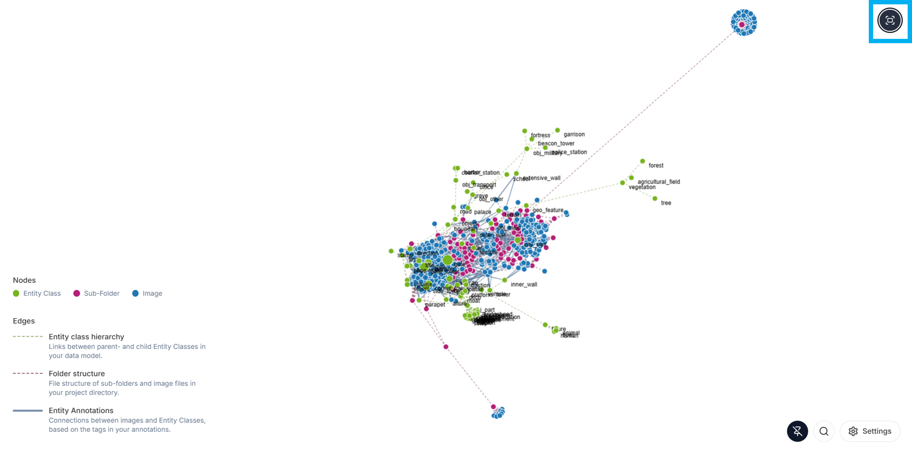
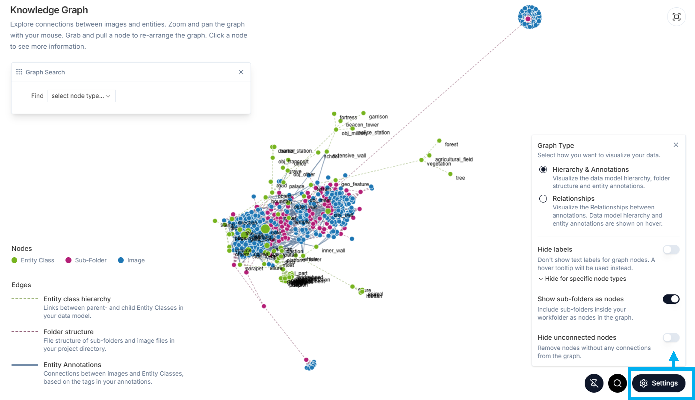
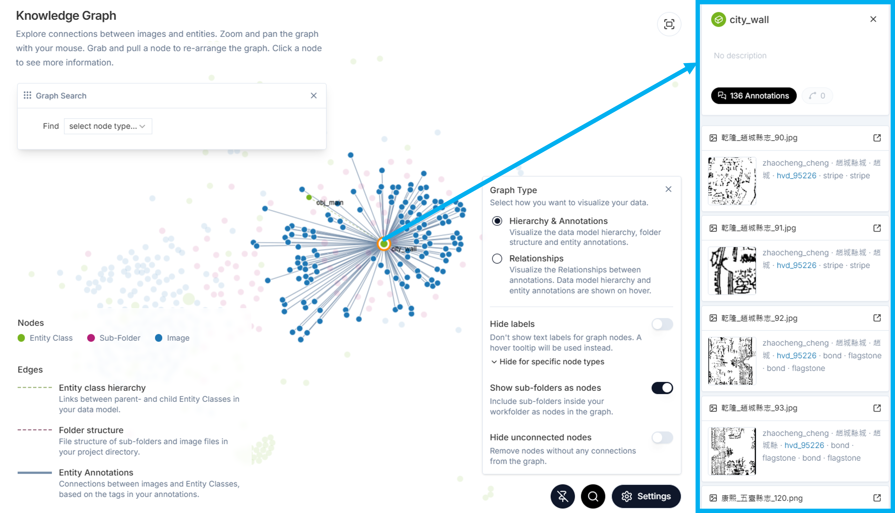
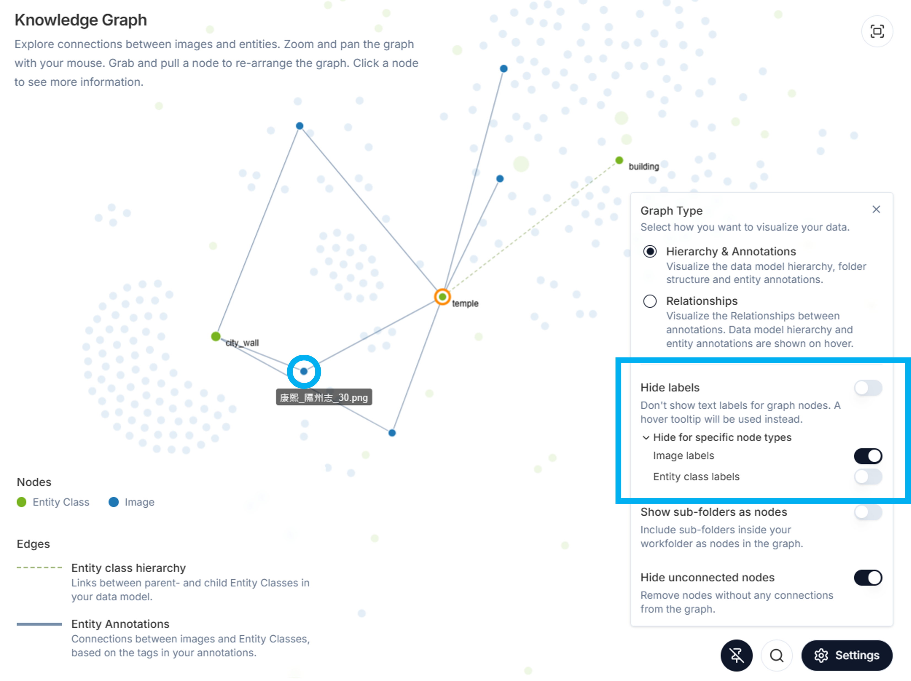

The **Knowledge Graph** (**Figure 1**) organizes data from all sources (folders and images) and allows you to view these sources, as well as all data and metadata annotations, to explore connections between them, and to navigate to the desired content.   

# Default View 

The default view shows all images (blue nodes) and entity classes (green nodes). To add subfolders as nodes to the default view see [Show Subfolders as Nodes](https://github.com/rsimon/immarkus/wiki/07-Exploring-Data-in-Knowledge-Graph#show-subfolders-as-nodes). You can also make changes to the default view using the buttons at the bottom right of the screen (see [Settings](https://github.com/rsimon/immarkus/wiki/07-Exploring-Data-in-Knowledge-Graph#settings)). 

Use the scroll wheel on your mouse to **zoom** into the knowledge graph. To **pan** the graph across the screen, click on an empty space on the graph and drag your cursor across the screen. You can also **expand** the graph to full screen by clicking on the expand button at the top right (circled in blue on **Figure 1**).

**Figure 1.** Knowledge Graph 

# Nodes
You can inspect individual nodes, move them, and pin them on the knowledge graph (**Figure 2**).  Click and drag a node to pin it on the knowledge graph. To unpin a node, click on the pin icon at the bottom of the screen (circled in blue). 

**Figure 2.** Pinning a Node (Tower) on the Knowledge Graph 

## Entity Class Nodes 

To see all annotations of a specific entity class click on an entity class node (in this case _stair_) (**Figure 3**). You can see an overview of the related annotations and relationships for this entity class. You can access the individual annotations by clicking on the **expand icon** (circled in **Figure3**). IMMARKUS will then take you to the individual image in the [Image Gallery](https://github.com/rsimon/immarkus/wiki/03-The-Interface). When you return to the Knowledge Graph page, the browser memory will retain the selected node.

**Figure 3.** Clicking on an Individual Entity Class to Select it

## Image Nodes 

If you want to see all entity classes and relationships annotated on an individual image, click on an image node (**Figure 4**). You can access the image by clicking on the **expand icon** (circled in **Figure 4**). IMMARKUS will then take you to the individual image in the [Image Gallery](https://github.com/rsimon/immarkus/wiki/03-The-Interface). When you return to the Knowledge Graph page, the browser memory will retain the selected node. 

**Figure 4.** Clicking on an Individual Image Node in the Knowledge Graph to Select it  

To view and modify image metadata in the **Knowledge Graph** view, select an image node and click on the **Metadata** button (outlined in blue).  From here you can also select a predefined schema and fill out image metadata (**Figure 5**). 

**Figure 5.** Viewing and Modifying Image Metadata in the Knowledge Graph 

To deselect a node in order to explore other nodes, click any where outside the selection or close the right panel.

# Settings 

Settings allow you to change the way the data is displayed. Clicking on the **Settings** icon on the bottom right corner of the knowledge graph will take you to a menu with several options. You can combine selections from those options to adapt the graph to your needs.  

## Choose Graph Type

You can choose to visualize your data in **Hierarchy & Annotations** mode, which shows the data model structure and entity annotations, or in **Relationships** mode, which shows the relationship annotations you created between entity classes. 

**Figure 6.** Choosing **Hierarchy & Annotations** Mode for the Knowledge Graph

## Hide Labels 

**Hide labels** hides text labels from the graph. You can further choose to only hide **Image** labels or **Entity Class** lables. You can view the labels by hovering over nodes (**Figure 7**). 

**Figure 7.** Hiding Image Labels in Knowledge Graph with the Label *光緒_代州志_36.jpg* Made Visible by Hovering over the Node 

## Show Subfolders as Nodes  

**Show subfolders as nodes** allows you to see the distribution of your images and entities across subfolders on the graph (crimson nodes on **Figure 8**)
 

**Figure 8.** Showing Subfolders as Nodes  

By clicking a subfolder node, you can view the total number of images in the folder and access its metadata. To navigate to the subfolder, click the **Open** button (outlined in blue). When you return to the Knowledge Graph page, the browser memory will retain the selected node. 
 

**Figure 9.** Selecting a Subfolder Node to View Its Metadata 

## Hide Unconnected Nodes  

**Hide unconnected nodes** hides unused entity classes and images without entity annotations and makes the graph less cluttered and focused on annotated content. 

**Figure 10.** Hiding Unconnected Nodes

## Knowledge Graph Search 

In **Graph Search** you can search and filter images in the current project according to metadata and/or properties; you can also export the results of your search.  

Start searching by clicking the magnifying glass icon (circled in blue on **Figure 11**). In both **Hierarchy & Annotations** and **Relationships** modes, you can either search subfolders by metadata, or search images by (image or subfolder) metadata, entity classes, or notes. 

In **Relationships mode**, you can search entity classes or images by the relationships that were added in annotation. 
 

**Figure 11.** Searching Images with *bridge* Entities in Graph Search

You can continue to filter your results by adding more search conditions (**Figure 12**): 

1. Click **Add Condition** to add an and/or condition to your search. 

2. **⊕ Sub-Condition** is only available for filtering according to a property of an entity class.  

3. Click **Export Search Result** to export the results of your search to an .XLSX file. 

4. Edit your search by either deleting individual conditions or sub-conditions.  

5. Reset the search by pressing the **Clear All button**. 

 **Figure 12.** Graph Search Options

You can further explore the search results by selecting individual nodes to view image or node data and/or by hovering over nodes to view the nodes to which they are related.

