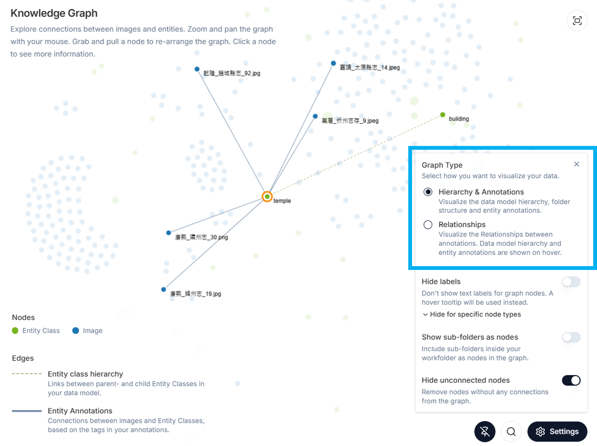

The **Knowledge Graph** (**Figure 1**) organizes data from all sources (folders and images) and allows you to view and query these sources, all data and metadata annotations, and the relations you established between them. You can also navigate to the desired content from the knowledge graph, and export your search results.   

# Default View 

## Nodes and Edges in the Graph

The default view shows all images (blue nodes) and entity classes (green nodes). Edges between images and annotations are shown as blue lines, with the weight indicating the number of connections. Edges representing parent-child relationships between entity classes in your data model are shown as green dashed lines.

To add subfolders as nodes to the default view, see [Show Subfolders as Nodes](https://github.com/rsimon/immarkus/wiki/07-Exploring-Data-in-Knowledge-Graph#show-subfolders-as-nodes). 

Use the scroll wheel on your mouse to **zoom** in and out of the knowledge graph. To **pan** the graph across the screen, click on an empty space on the graph and drag your cursor across the screen. 

  
**Figure 1.** Default View of Knowledge Graph 

Hovering over a node highlights its related nodes and edges. When hovering over an annotation edge, a tooltip displays the number of annotations connected to the corresponding image.

  
**Figure 2.** Highlighting Connections by Hovering Over the Node "platform"

  
**Figure 3.** Tooltip Displaying the Number of Annotations Linked to an Image

## View Options and Controls

* **Legend Panel**:  Displays a guide to what each node and edge represents in the graph.  

      
    **Figure 4.** Legend Panel in the Knowledge Graph

* **Full Screen Expander**: Click the **expand** button (outlined in blue in **Figure 5**) to view the graph in full-screen mode.  

      
    **Figure 5.** Viewing the Knowledge Graph in Full-screen Mode  

* **Graph Searcher**: Click the **magnify glass** (outlined in blue in **Figure 6**) icon to open the graph search dialog box and enter search conditions. See [Knowledge Graph Search](07-Exploring-Data-in-Knowledge-Graph#knowledge-graph-search) for more more details on graph search and export.

      
    **Figure 6** Opening the Graph Search Dialog Box

* **Settings**: Click the **Settings** button to customize the knowledge graph view (see [Settings](https://github.com/rsimon/immarkus/wiki/07-Exploring-Data-in-Knowledge-Graph#settings)). 
    
      
    **Figure 7** Adjusting the Knowledge Graph View in the Settings Panel 

* **Details Panel**: Clicking on a node expands a panel on the right, allowing you to explore related annotations, images, relations, and metadata. You can also navigate to the image **Annotation Mode** from here.

      
    **Figure 8** Navigating Details Panel for the Seleted Entity Class "city_wall"

# Settings 

From Settings you can change the way the data is displayed. Clicking on the **Settings** icon on the bottom right corner of the knowledge graph will take you to a menu with several options. You can combine selections from those options to adapt the graph to your needs.  

## Choose Graph Type

You can choose to visualize your data in **Hierarchy & Annotations** mode, which shows the data model structure and entity annotations, or in **Relationships** mode, which shows the relationship annotations you created between entity classes. 

  
**Figure 9.** Choosing **Hierarchy & Annotations** Mode for the Knowledge Graph

## Hide Labels 

**Hide labels** hides text labels from the graph. You can further choose to only hide **Image** labels or **Entity Class** lables. You can view the labels by hovering over nodes (**Figure 10**). 

  
**Figure 10.** Hiding Image Labels in the Knowledge Graph with the Label *康熙_隰州志_30.png* Made Visible by Hovering over the Node 

## Show Subfolders as Nodes  

**Show subfolders as nodes** allows you to see the distribution of your images and entities across subfolders on the graph (crimson nodes on **Figure 11**)
 
  
**Figure 11.** Showing Subfolders as Nodes  

## Hide Unconnected Nodes  

**Hide unconnected nodes** hides unused entity classes and images without entity annotations and makes the graph less cluttered and focused on annotated content. 

  
**Figure 12a.** Before Selecting "Hide unconnected nodes": Image Nodes without Annotations Displayed as Unconnected Nodes in the Graph

  
**Figure 12b.** After Selecting "Hide unconnected nodes": Image Nodes without Annotations are Hidden from the Graph

# Nodes
You can inspect individual nodes, move them, and pin them on the knowledge graph (**Figure 2**).  Click and drag a node to pin it on the knowledge graph. To unpin a node, click on the pin icon at the bottom of the screen (circled in blue). 

**Figure 2.** Pinning a Node (Tower) on the Knowledge Graph 

## Entity Class Nodes 

To see all annotations of a specific entity class click on an entity class node (in this case _stair_) (**Figure 3**). You can see an overview of the related annotations and relationships for this entity class. You can access the individual annotations by clicking on the **open image icon** (circled in **Figure 3**). IMMARKUS will then take you to the individual image in the [Image Gallery](https://github.com/rsimon/immarkus/wiki/03-The-Interface). When you return to the Knowledge Graph, the browser memory will have retained the selected view and node.

**Figure 3.** Clicking on an Individual Entity Class to Select it

## Image Nodes 

If you want to see all entity classes and relationships annotated on an individual image, click on an image node (**Figure 4**). You can access the image by clicking on the **open image icon** (circled in **Figure 4**). IMMARKUS will then take you to the individual image in the [Image Gallery](https://github.com/rsimon/immarkus/wiki/03-The-Interface). When you return to the Knowledge Graph, the browser memory will have retained the selected view and node. 

**Figure 4.** Clicking on an Individual Image Node in the Knowledge Graph to Select it  

To view and modify image metadata in the **Knowledge Graph** view, select an image node and click on the **Metadata** button (outlined in blue).  From here you can also select a predefined schema and fill out image metadata (**Figure 5**). 

**Figure 5.** Viewing and Modifying Image Metadata in the Knowledge Graph 

To deselect a node in order to explore other nodes, click any where outside the selection or close the right panel.

## Subfolder Nodes 

By clicking a subfolder node, you can view the total number of images in the folder and access its metadata. To navigate to the subfolder, click the **Open** button (outlined in blue). When you return to the Knowledge Graph page, the browser memory will retain the selected node. 
 

**Figure 9.** Selecting a Subfolder Node to View Its Metadata 

# Knowledge Graph Search 

In **Graph Search** you can search and filter images in the current project according to metadata and/or properties; you can also export the results of your search.  

Start searching by clicking the magnifying glass icon (circled in blue on **Figure 11**). In **Hierarchy & Annotations** you can search either subfolders by metadata, or images by (image or subfolder) metadata, entity classes, or notes. 

In **Relationships mode**, you can search entity classes or images by the relationships that were added in annotation. 
 

**Figure 11.** Searching Images with *bridge* Entities in Graph Search

You can further explore the search results by selecting individual nodes to view image or node data and/or by hovering over nodes to view the nodes to which they are related.

## Graph Search Options

You can continue to filter your results by adding more search conditions (**Figure 12**): 

1. Click **Add Condition** to add an and/or condition to your search. 

2. **⊕ Sub-Condition** is only available for filtering according to a property of an entity class.  

3. Edit your search by either deleting individual conditions or sub-conditions.  

4. Reset the search by pressing the **Clear All button**. 

 **Figure 12.** Graph Search Options

## Export Graph Search Result

Click **Export Search Result** to export the results of your search to an .XLSX file. 

