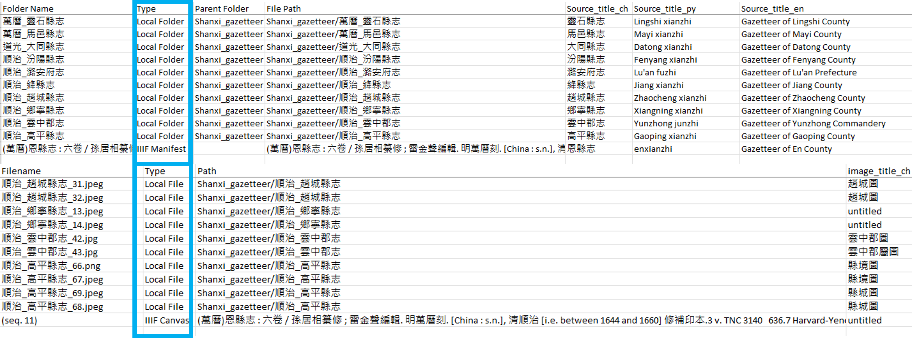

You can export your data models, annotations, and metadata. Click on the **Export** page in the [IMMARKUS Interface](https://github.com/rsimon/immarkus/wiki/03-The-Interface) and select the data you wish to export.

## Exporting Annotations

Click and download **Annotations**.  
 1. **Annotation Data**: export all annotations as a flat list in the [W3C Web Annotation](https://www.w3.org/TR/annotation-model/) JSON-LD format (JSON for Linked Data, a specification for encoding contextualized meaning into JSON documents).
 2. **Annotations and Images**: generates one XLSX file with multiple worksheets. Each worksheet is for each top-level (parent) entity class. 
Each property is exported as a column followed by the image snippet, the file name, the annotation ID, and the time when the annotation was created.

**Figure 1.** Exporting Annotations

## Exporting Relationships

Click and download **Relationships**. 

1. **Relationship Data**: export all relationships created between entity classes as a flat list in the [W3C Web Annotation](https://www.w3.org/TR/annotation-model/) JSON-LD format. 

2. **Relationships and Images**: export all relationships created between entity classes on all images in your current work folder as a single XLSX file. Each relationship is exported as a column, followed by the start- (source) annotation snippet, its file and folder name, and entity class, as well as the end (target) annotation snippet, its file and folder name, and entity class.   

**Figure 2.** Exporting Relationships Created between Entity Classes

## Exporting a Data Model

In **Data Model** you can select what to export: **Entity Classes**, **Relationship Types**, **Image Metadata**, **Folder Metadata**, or the entire **IMMARKUS Data Model**. All the exports are downloaded as a JSON file.  

**Full IMMARKUS Data Model** is the same file you will find in your working folder as _immarkus.model.json.

**Figure 3.** Exporting a Data Model

## Exporting Metadata

Click **Metadata** and select either **Image** or **Folder Metadata**. The metadata will be downloaded as a flat list in a CSV spreadsheet. 

**Figure 4.** Exporting Metadata

A **Type** column (outlined in **Figure 5**) will be generated in the Metadata export to specify whether the folder or image originates locally or from an IIIF import.

**Figure 5.** **Type** Column Indicating Folder and Image Sources in Exported Metadata Files

Currently, the IIIF embedded metadata is only available for viewing within IMMARKUS interfaces and is not included in the export file. 