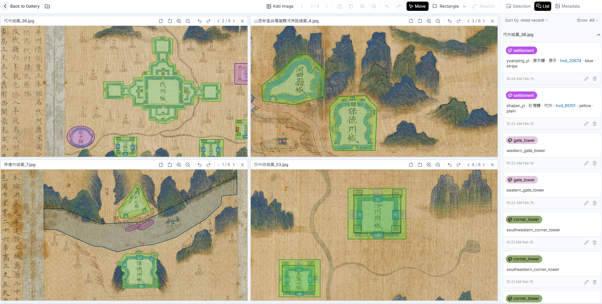

IMMARKUS is a semantic image annotation tool that allows you to create custom ontologies, make selections on images, identify specific image regions using ontological concepts, and add relationships between elements in your images.  

**Figure 1**. Annotating City Walls of the Counties in Shanxi with IMMARKUS

Setting up IMMARKUS is straightforward and hassle-free. Open IMMARKUS in your browser, select a folder on your computer, and begin annotating.

IMMARKUS operates fully locally without transmitting data to a server. All images, data models, and annotations are stored on your computer, ensuring complete privacy and control over your work.  

# **Funding Support**

IMMARKUS: Image Annotation has been developed by Prof. Dr. Hilde De Weerdt, Dr. Rainer Simon, Dr. Lee Sunkyu, Dr. Iva Stojević, Dawn Zhuang, Meret Meister, and Xi Wangzhi as part of the Regionalizing Infrastructures in Chinese History ([RegInfra](https://www.infrastructurelives.eu/)) project. 

This research is part of a project that has received funding from the European Research Council (ERC) under the European Union’s Horizon 2020 research and innovation programme (Grant agreement No. 101019509).

# **How to Cite Us**

**Platform**:

Hilde De Weerdt, Rainer Simon, Lee Sunkyu, Iva Stojević, Dawn Zhuang, Meret Meister, and Xi Wangzhi. IMMARKUS: Image Annotation in X-MARKUS. 2024. [immarkus.xmarkus.org](https://immarkus.xmarkus.org/)

**Instructions (wiki)**:

Hilde De Weerdt, Rainer Simon, Lee Sunkyu, Iva Stojević and Dawn Zhuang. Image Annotation in IMMARKUS Wiki. 2024. [github.com/rsimon/immarkus/wiki](https://github.com/rsimon/immarkus/wiki)

**Code**:

Rainer Simon. IMMARKUS: Image Annotation in X-MARKUS. 2024. [github.com/rsimon/immarkus](https://github.com/rsimon/immarkus) 